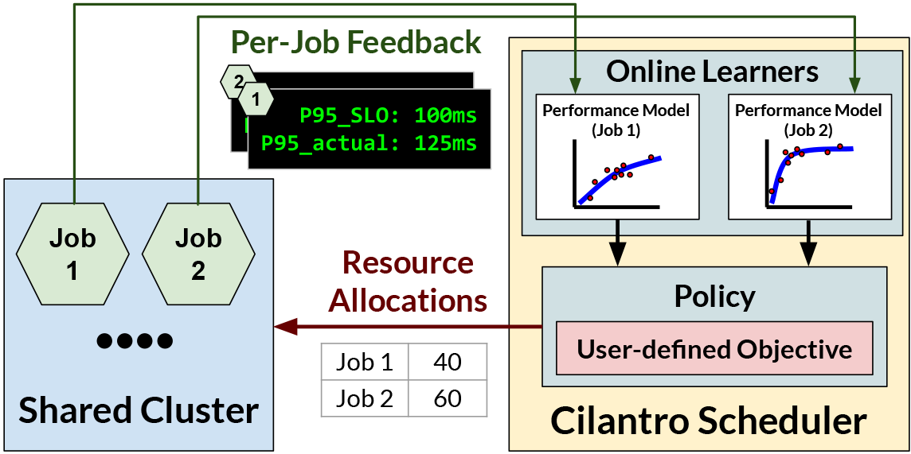

# Cilantro: Performance-Aware Resource Allocation for General Objectives via Online Feedback 

  <picture>
      
  </picture>

Cilantro is a scheduling framework for performance-aware allocation of resources 
among competing jobs. Unlike other schedulers, which require jobs to state resource demands, Cilantro applies online-learning to dynamically allocate resources 
optimizing for the user stated [objective](https://github.com/romilbhardwaj/cilantro/cilantro/policies).
Objectives may be defined on individual utilities reported by jobs, such as 
latency and throughput SLOs.

For more details, please refer to our [OSDI 2023 paper](#).

## Running Cilantro Experiments

Below we link to two examples of running Cilantro on Kubernetes clusters. These experiments were used in our paper.

### [Microservices experiments](./experiments/microservices/README.md)

This experiment borrows the hotel-reservation benchmark from [Deathstarbench](https://github.com/delimitrou/DeathStarBench) to demonstrate
the application of cilantro to an application composed of many microservices. Cilantro can optimize the 
end-to-end performance of the application by individually controlling the resource 
allocation of each microservice. See Section 6.2 in the paper for more details.

Please follow [`experiments/microservices/README.md`](./experiments/microservices/README.md) for instructions on how to run this experiment.

### [Cluster sharing experiments](./experiments/cluster_sharing/README.md)

This experiment evaluates Cilantro’s multi-tenant policies (Section 4.1.2 in the paper) 
on a 1000 CPU cluster shared by 20 users. Please refer to Section 6.1 in the paper for more details. 

Please follow [`experiments/cluster_sharing/README.md`](./experiments/cluster_sharing/README.md) for instructions on how to run this experiment.

## Directory Structure
* [`./cilantro`](./cilantro) contains the core Cilantro code base.
  * [`./cilantro/policies`](./cilantro/policies) contains implementations Cilantro's policies and other baselines.
  * [`./cilantro/backends`](./cilantro/backends) contains different event sources (gRPC, Kubernetes, timer) supported in Cilantro.
  * [`./cilantro/learners`](./cilantro/learners) contains implementations of different online learning algorithms used in Cilantro.
  * [`./cilantro/scheduler`](./cilantro/scheduler) contains the main scheduler loop.
* [`./experiments`](./experiments) contains the code for running Cilantro experiments presented in our paper.
* [cilantro-workloads](https://github.com/romilbhardwaj/cilantro-workloads) is a sister repository that contains the workloads used in our paper. These workloads are already compiled and pushed to Cilantro's ECR repository.

## Notes
* If you'd like to build your own image for Cilantro, please refer to [`./eks/README.md`](./eks/README.md) for instructions on how to create your own image registry on AWS ECR and build/push cilantro images to it.
* [`./README_DEV.md`](./README_DEV.md) contains instructions for developers who want to modify and extend Cilantro.

## Citing Cilantro
Coming soon!
